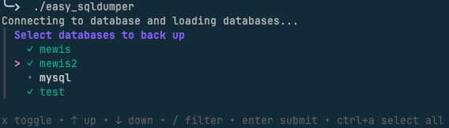

# Easy SQLdumper

A CLI tool for creating timestamped SQL backups of **MySQL/MariaDB** and **PostgreSQL** databases, configured via a TOML file. Supports **local**, **Docker** and **Kubernetes** database targets with an interactive multiselect TUI.

## Demo



## Table of Contents

- [Features](#features)
- [Requirements](#requirements)
- [Installation](#installation)
- [Man Page](#man-page)
- [Makefile targets](#makefile-targets)
- [Configuration](#configuration)
  - [Full example](#full-example-easy_sql_configtoml)
  - [Docker (MySQL / MariaDB)](#docker-example-mysql--mariadb)
  - [Kubernetes (MySQL / MariaDB)](#kubernetes-example-mysql--mariadb)
  - [PostgreSQL – local](#postgresql--local-example)
  - [PostgreSQL – Kubernetes](#postgresql--kubernetes-example)
- [Shell Integration (init)](#shell-integration-init)
- [Usage](#usage)
  - [Interactive TUI controls](#interactive-tui-controls)
  - [Flags](#flags)
- [Output](#output)
- [Secrets Management](#secrets-management)
  - [env: – environment variable](#env--environment-variable)
  - [file: – Docker & Kubernetes secret mount](#file--file--docker--kubernetes-secret-mount)
  - [vault: – HashiCorp Vault or OpenBao](#vault--hashicorp-vault-or-openbao)
  - [doppler: – Doppler](#doppler--doppler)
- [Security](#security)
- [License](#license)
- [Changelog](#changelog)

## Features

- 📦 Timestamped backup files (`dbname_2026-03-24_15-04-05.sql`)
- 🔐 Secure password handling via `--defaults-extra-file` or `MYSQL_PWD` / `PGPASSWORD` (not visible in `ps aux`)
- 🔒 Optional SSL/TLS support with startup validation (MySQL/MariaDB)
- 🐬 MySQL / MariaDB support (`mysqldump` / `mariadb-dump`)
- 🐘 PostgreSQL support (`pg_dump`)
- 🐳 Docker container support (`docker exec`)
- ☸️ Kubernetes pod support (`kubectl exec`)
- ⚙️ Simple TOML configuration
- 🎛️ Interactive multiselect TUI powered by [`charmbracelet/huh`](https://github.com/charmbracelet/huh)
- 🧹 Automatic cleanup of partial backups on failure
- 🚀 One-command shell integration via `sqldumper init` (bash, fish, nushell)

## Requirements

- Go 1.22+
- For **local MySQL/MariaDB** mode: `mysql` and `mysqldump` (or `mariadb` / `mariadb-dump`) in `$PATH`
- For **local PostgreSQL** mode: `psql` and `pg_dump` in `$PATH`
- For **Docker** mode: `docker` available in `$PATH`
- For **Kubernetes** mode: `kubectl` configured and available in `$PATH`

## Installation

```bash
git clone https://github.com/nerdwarts/easy_sqldumper.git
cd easy_sqldumper
go build -o sqldumper ./cmd/sqldumper
```

Pre-built binaries for `arm64` and `x64` are attached to each release.

## Man Page

A man page is included at `docs/sqldumper.1`. Install it with:

```bash
# Install binary + man page (requires write access to /usr/local)
make install

# Install only the man page
make install-man

# Install to a custom prefix (e.g. ~/.local)
make install PREFIX=~/.local
```

After installation:

```bash
man sqldumper
```

To uninstall:

```bash
make uninstall
```

### Manual install (without make)

```bash
# macOS / Linux
sudo cp docs/sqldumper.1 /usr/local/share/man/man1/sqldumper.1
sudo gzip /usr/local/share/man/man1/sqldumper.1   # optional but conventional
man sqldumper
```

## Makefile targets

| Target | Description |
|--------|-------------|
| `make build` | Build binary for the current platform |
| `make build-all` | Cross-compile for Linux & macOS (arm64 + x64) |
| `make install` | Build + install binary and man page to `$(PREFIX)/` |
| `make install-man` | Install only the man page |
| `make uninstall` | Remove binary and man page |
| `make clean` | Remove local build artefacts |

## Configuration

Copy and edit the example config file:

```bash
cp easy_sql_config.toml my-config.toml
```

### Full example (`easy_sql_config.toml`)

```toml
[database]
# "mysql" (default) or "postgres"
type     = "mysql"
user     = "root"
password = "your_password"
host     = "localhost"   # use 127.0.0.1 for local; ignored in remote modes
port     = 3306          # optional – defaults: mysql=3306, postgres=5432

[ssl]
enabled             = false
ca                  = "/path/to/ca-cert.pem"
cert                = "/path/to/client-cert.pem"
key                 = "/path/to/client-key.pem"
verify_server_cert  = false

# Remote mode – binaries are executed inside the container.
# type = "local"      → binaries available locally in $PATH (default)
# type = "docker"     → docker exec <container> <bin> ...
# type = "kubernetes" → kubectl exec <pod> -- <bin> ...
[remote]
type = "local"
```

### Docker example (MySQL / MariaDB)

```toml
[database]
user     = "root"
password = "your_password"
host     = "127.0.0.1"
port     = 3306

[remote]
type          = "docker"
container     = "my-mysql-container"
mysql_bin     = "mariadb"        # binary name inside the container
mysqldump_bin = "mariadb-dump"   # binary name inside the container
```

### Kubernetes example (MySQL / MariaDB)

```toml
[database]
user     = "root"
password = "your_password"
host     = "127.0.0.1"
port     = 3306

[remote]
type      = "kubernetes"   # or "k8s"
namespace = "default"      # omit to use the current kubectl context namespace
pod       = "mariadb-685858c-w4xsg"
# container = "mariadb"   # optional – only needed if the pod has multiple containers
mysql_bin     = "mysql"
mysqldump_bin = "mysqldump"
```

### PostgreSQL – local example

```toml
[database]
type     = "postgres"
user     = "postgres"
password = "your_password"
host     = "localhost"
port     = 5432            # optional, auto-set when type = "postgres"
```

### PostgreSQL – Kubernetes example

```toml
[database]
type     = "postgres"
user     = "postgres"
password = "your_password"
host     = "127.0.0.1"
port     = 5432

[remote]
type       = "kubernetes"
namespace  = "default"
pod        = "postgres-abc123"
# psql_bin   = "psql"     # optional – defaults to "psql"
# pgdump_bin = "pg_dump"  # optional – defaults to "pg_dump"
```

> **Note:** In Docker and Kubernetes modes the password is injected via the `MYSQL_PWD` (MySQL/MariaDB) or `PGPASSWORD` (PostgreSQL) environment variable inside the container, so no temporary credential file is written to disk.

## Shell Integration (init)

Run `sqldumper init` once after installation to add the binary to `$PATH` and register a short `esd` alias in your shell config:

```bash
sqldumper init                  # auto-detect shell
sqldumper init --shell fish     # force a specific shell
sqldumper init --no-alias       # skip the esd alias
```

### Shell detection

The shell is auto-detected in order from: `$FISH_VERSION` (fish), `$NU_VERSION` (nushell), then `basename($SHELL)`. Use `--shell` to override.

### Flags

| Flag | Default | Description |
|------|---------|-------------|
| `--shell` | auto-detect | Target shell: `bash`, `fish`, `nu` |
| `--no-alias` | `false` | Skip creating the `esd` alias |

### What gets written

| Shell | File(s) | Lines added |
|-------|---------|-------------|
| **bash** | `~/.bashrc` (or `~/.bash_profile`) | `export PATH="/path:$PATH"` and `alias esd="/path/to/sqldumper"` |
| **fish** | `~/.config/fish/config.fish` | `fish_add_path "/path"` and `alias esd="/path/to/sqldumper"` |
| **nushell** | `env.nu` (PATH) and `config.nu` (alias) | `$env.PATH = ($env.PATH \| prepend "…")` and `alias esd = /path/to/sqldumper` |

All writes are **idempotent** — running `init` twice will not duplicate lines. Parent directories are created automatically if they don't exist.

---

## Usage

```bash
# Interactive TUI – multiselect databases from a list
./sqldumper

# CLI / scripting / cron mode – non-interactive
./sqldumper -db my_database

# Custom config and output directory
./sqldumper -db my_database -config /etc/easy_sql_config.toml -dir /var/backups/mysql
```

### Interactive TUI controls

| Key      | Action |
|----------|--------|
| `↑` / `↓` | Navigate up / down |
| `x` or `Space` | Toggle selection |
| `Ctrl+A` | Select / deselect all |
| `Enter`  | Confirm selection and start backups |
| `Ctrl+C` | Quit without doing anything |

### Flags

| Flag      | Default                    | Description                                              |
|-----------|----------------------------|----------------------------------------------------------|
| `-db`     | *(empty → opens TUI)*      | Name of the database to back up                                       |
| `-dir`    | `./backup`                 | Directory to save the backup file                                     |
| `-config` | next to the binary         | Path to the TOML configuration file                                   |
| `-type`   | *(from config)*            | Database type: `mysql` or `postgres` (overrides config)               |

## Output

Backups are saved as:

```
<dir>/<dbname>_<YYYY-MM-DD_HH-MM-SS>.sql
```

Example: `./backup/my_database_2026-03-24_15-04-05.sql`

## Secrets Management

Instead of storing the database password as a plain string in the config file, you can reference a secret from an external backend using a prefix in the `password` field. All other config values remain unchanged — this is fully backward compatible.

### Supported backends

| Prefix | Resolves from | Example |
|--------|--------------|---------|
| *(no prefix)* | Literal value | `"s3cr3t"` |
| `env:` | OS environment variable | `"env:DB_PASSWORD"` |
| `file:` | File contents (trailing newline stripped) | `"file:/run/secrets/db_pass"` |
| `vault:` | HashiCorp Vault **or OpenBao** KV v2 | `"vault:secret/data/myapp#db_password"` |
| `doppler:` | Doppler | `"doppler:DB_PASSWORD"` |

---

### `env:` — environment variable

Works with **any** secret manager that supports env-var injection (Doppler CLI, Vault Agent, AWS Secrets Manager, 1Password CLI, …):

```toml
[database]
password = "env:DB_PASSWORD"
```

```bash
# Doppler CLI injects env vars automatically:
doppler run -- sqldumper

# Vault Agent can also inject env vars:
DB_PASSWORD=... sqldumper
```

---

### `file:` — file / Docker & Kubernetes secret mount

```toml
[database]
password = "file:/run/secrets/db_password"
```

```yaml
# Kubernetes secret volume example
volumes:
  - name: db-secret
    secret:
      secretName: my-db-secret
volumeMounts:
  - name: db-secret
    mountPath: /run/secrets
    readOnly: true
```

---

### `vault:` — HashiCorp Vault or OpenBao

Both Vault and [OpenBao](https://openbao.org) use the same API — only the `address` differs.

```toml
[database]
password = "vault:secret/data/myapp#db_password"
#                 ^^^^^^^^^^^^^^^^^ KV v2 path
#                                   ^^^^^^^^^^^ field name inside the secret

[secrets.vault]
address = "https://vault.example.com:8200"
token   = "env:VAULT_TOKEN"   # token itself can be an env: reference
```

The path format is `mount/data/path-to-secret#field`, which matches the [KV v2 API path](https://developer.hashicorp.com/vault/docs/secrets/kv/kv-v2).

**OpenBao** — identical config, just point `address` at your OpenBao server:
```toml
[secrets.vault]
address = "https://openbao.example.com:8200"
token   = "env:VAULT_TOKEN"
```

---

### `doppler:` — Doppler

```toml
[database]
password = "doppler:DB_PASSWORD"

[secrets.doppler]
token   = "env:DOPPLER_TOKEN"   # or a Service Token literal
project = "my-project"
config  = "production"
```

> **Tip:** For Doppler, the `env:` prefix approach is simpler if you already use the Doppler CLI (`doppler run -- sqldumper`). The native `doppler:` integration is useful when you cannot run the CLI (e.g. inside a container without the CLI installed).

---

## Security

Passwords are **never** passed as plain CLI arguments.

- **Local MySQL/MariaDB:** the password is written to a temporary file (`sqldumper-*.cnf`) and passed to `mysqldump` via `--defaults-extra-file`. The file is deleted immediately after the dump completes.
- **Local PostgreSQL:** the password is set via `PGPASSWORD` on the subprocess — no temp file is created.
- **Docker / Kubernetes mode:** the password is injected via `MYSQL_PWD` or `PGPASSWORD` directly inside the container process — no temp file is created on the host.

## License

Copyright 2026 Nerdwarts

Licensed under the [Apache License, Version 2.0](LICENSE).

---

## Changelog

### v1.5.0 – Shell Integration *(2026-03-30)*

#### ✨ New Features
- **`sqldumper init`** — new subcommand that sets up the binary in your shell after installation:
  - Adds the binary's directory to `$PATH`
  - Registers an `esd` alias pointing to the binary's absolute path
  - Supports **bash**, **fish** and **nushell**
  - Auto-detects the active shell; override with `--shell bash|fish|nu`
  - `--no-alias` flag skips alias creation
  - All writes are idempotent and annotated with a comment
  - Respects `$XDG_CONFIG_HOME` for fish and nushell config paths
- **Config file resolved next to the binary** — the default `-config` path is now computed relative to the binary's own location (symlinks resolved), so the tool works regardless of the working directory

---

### v1.4.1 – Project layout refactoring *(2026-03-29)*

#### ♻️ Refactoring
- Source code migrated to a standard Go project layout:
  - `cmd/sqldumper/` — entry point and integration tests
  - `internal/config/` — `Config` struct, constants, `LoadConfig`
  - `internal/secrets/` — secret resolution (env, file, Vault, Doppler)
  - `internal/runner/` — `BackupRunner` (Run, FetchDatabases)
  - `internal/tui/` — interactive multiselect TUI flow
- No behaviour changes; all existing flags, config files and outputs remain identical

---

### v1.4.0 – Secrets Management *(2026-03-29)*

#### ✨ New Features
- **Secret backend support** – the `password` field in `[database]` now accepts prefix-based secret references instead of plain-text values:
  - `env:VAR` – OS environment variable (works with any env-injecting tool: Doppler CLI, Vault Agent, 1Password CLI, …)
  - `file:/path` – file contents; trailing newlines stripped (Docker/Kubernetes secret mounts)
  - `vault:mount/path#field` – HashiCorp Vault or **OpenBao** KV v2 via HTTP API (no SDK dependency)
  - `doppler:SECRET_NAME` – Doppler via HTTP API (no SDK dependency)
- **`[secrets.vault]`** config section – `address` and `token` for Vault / OpenBao
- **`[secrets.doppler]`** config section – `token`, `project`, `config` for Doppler
- Token fields themselves support `env:` references so no credentials are ever stored in plain text

#### ✅ Backward Compatible
Literal passwords continue to work without any config changes.

---

### v1.3.0 – Multiselect TUI, SSL Validation & Code Refactoring *(2026-03-28)*

#### ✨ New Features
- **Multiselect TUI** – replaced the single-select Bubble Tea table with a [`charmbracelet/huh`](https://github.com/charmbracelet/huh) multiselect; back up multiple databases in one run
- **SSL configuration validation** – on startup, the tool now validates the SSL config before connecting:
  - `ssl.ca` is required when `enabled = true`; file existence is checked
  - `ssl.cert` and `ssl.key` must always be provided together
  - `ssl.verify_server_cert = true` requires `ssl.ca` to be set
  - SSL is not supported for PostgreSQL (hard error)
  - Orphaned SSL fields when `enabled = false` produce a clear warning

#### ♻️ Refactoring
- Source code split into focused files: `main.go`, `config.go`, `runner.go`, `tui.go`

#### 🎛️ TUI controls
| Key            | Action |
|----------------|--------|
| `↑` / `↓`      | Navigate |
| `x` or `Space` | Toggle selection |
| `Ctrl+A`       | Select / deselect all |
| `Enter`        | Confirm and start backups |
| `Ctrl+C`       | Quit without doing anything |

---

### v1.2.0 – PostgreSQL Support *(2026-03-28)*

#### ✨ New Features
- **PostgreSQL support** – use `pg_dump` / `psql` instead of `mysqldump` / `mysql`; set `type = "postgres"` in `[database]` or pass `-type postgres` on the CLI
- **`-type` flag** – override the database engine at runtime without editing the config file
- **`psql_bin` / `pgdump_bin`** – configurable binary names for PostgreSQL (useful for custom installations)
- **Auto default port** – port is automatically set to `5432` when `type = "postgres"` and no port is specified
- **`PGPASSWORD` injection** – passwords for PostgreSQL are never passed as CLI args; injected securely via env var in all modes (local, Docker, Kubernetes)

---

### v1.1.0 – Remote Backends & Interactive TUI *(2026-03-28)*

#### ✨ New Features
- **Docker support** – run `mysqldump`/`mysql` inside a Docker container via `docker exec`; password is injected via `MYSQL_PWD` (no temp file on the host)
- **Kubernetes support** – run dumps inside a K8s pod via `kubectl exec`; supports optional namespace and multi-container pods
- **Interactive TUI** – Bubble Tea-powered table UI to browse and select databases interactively
- **Custom binary names** – configure `mysql_bin` / `mysqldump_bin` per remote target (useful for MariaDB: `mariadb`, `mariadb-dump`)
- **SSL/TLS support** – configure CA, cert, key and server-cert verification in the `[ssl]` section

#### ♻️ Refactoring
- Config file renamed from `dumper.toml` → `easy_sql_config.toml`
- Module and binary renamed for clarity
- Password handling: local mode uses `--defaults-extra-file` (temp file), remote modes use `MYSQL_PWD` env injection inside the container

#### 🔒 Security
- Passwords are never passed as plain CLI arguments in any mode
- Temp credential files are deleted immediately after use (local mode)

#### 📝 Docs
- README updated with Docker & Kubernetes examples, flag reference, security section and demo screenshot

---

### v1.0.0 – Initial Release *(2026-03-24)*

- Initial implementation of MySQL/MariaDB dump CLI tool
- TOML-based configuration (`dumper.toml`)
- Timestamped backup files
- Secure password handling via `--defaults-extra-file`
- Automatic cleanup of partial backups on failure
- Pre-built binaries for `arm64` and `x64`
