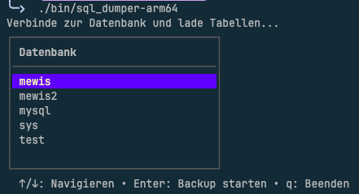

# Easy SQLdumper

A minimal CLI tool that wraps `mysqldump` to create timestamped SQL backups of MySQL/MariaDB databases, configured via a TOML file. Supports **local**, **Docker** and **Kubernetes** database targets.

## Demo



## Features

- 📦 Timestamped backup files (`dbname_2026-03-24_15-04-05.sql`)
- 🔐 Secure password handling via `--defaults-extra-file` or `MYSQL_PWD` (not visible in `ps aux`)
- 🔒 Optional SSL/TLS support
- 🐳 Docker container support (`docker exec`)
- ☸️ Kubernetes pod support (`kubectl exec`)
- ⚙️ Simple TOML configuration
- 🎛️ Interactive TUI for database selection (Bubble Tea)
- 🧹 Automatic cleanup of partial backups on failure

## Requirements

- Go 1.22+
- For **local** mode: `mysql` and `mysqldump` available in `$PATH`
- For **Docker** mode: `docker` available in `$PATH`
- For **Kubernetes** mode: `kubectl` configured and available in `$PATH`

## Installation

```bash
git clone https://github.com/youruser/sqldumper.git
cd sqldumper
go build -o sqldumper .
```

## Configuration

Copy and edit the example config file:

```bash
cp easy_sql_config.toml my-config.toml
```

### Full example (`easy_sql_config.toml`)

```toml
[database]
user     = "root"
password = "your_password"
host     = "localhost"   # use 127.0.0.1 for local; ignored in remote modes
port     = 3306          # optional, defaults to 3306

[ssl]
enabled             = false
ca                  = "/path/to/ca-cert.pem"
cert                = "/path/to/client-cert.pem"
key                 = "/path/to/client-key.pem"
verify_server_cert  = false

# Remote mode – mysql/mysqldump is executed inside the container.
# type = "local"      → mysql/mysqldump available locally in $PATH (default)
# type = "docker"     → docker exec <container> mysqldump ...
# type = "kubernetes" → kubectl exec <pod> -- mysqldump ...
[remote]
type = "local"
```

### Docker example

```toml
[database]
user     = "root"
password = "your_password"
host     = "127.0.0.1"
port     = 3306

[remote]
type          = "docker"
container     = "my-mysql-container"
mysql_bin     = "mariadb"        # binary name inside the container
mysqldump_bin = "mariadb-dump"   # binary name inside the container
```

### Kubernetes example

```toml
[database]
user     = "root"
password = "your_password"
host     = "127.0.0.1"
port     = 3306

[remote]
type      = "kubernetes"   # or "k8s"
namespace = "default"      # omit to use the current kubectl context namespace
pod       = "mariadb-685858c-w4xsg"
# container = "mariadb"   # optional – only needed if the pod has multiple containers
mysql_bin     = "mysql"
mysqldump_bin = "mysqldump"
```

> **Note:** In Docker and Kubernetes modes the password is injected via the `MYSQL_PWD` environment variable inside the container, so no temporary credential file is written to disk.

## Usage

```bash
# Interactive TUI – select the database from a list
./sqldumper

# CLI / scripting / cron mode – non-interactive
./sqldumper -db my_database

# Custom config and output directory
./sqldumper -db my_database -config /etc/easy_sql_config.toml -dir /var/backups/mysql
```

### Flags

| Flag      | Default                    | Description                         |
|-----------|----------------------------|-------------------------------------|
| `-db`     | *(empty → opens TUI)*      | Name of the database to back up     |
| `-dir`    | `./backup`                 | Directory to save the backup file   |
| `-config` | `./easy_sql_config.toml`   | Path to the TOML configuration file |

## Output

Backups are saved as:

```
<dir>/<dbname>_<YYYY-MM-DD_HH-MM-SS>.sql
```

Example: `./backup/my_database_2026-03-24_15-04-05.sql`

## Security

Passwords are **never** passed as plain CLI arguments.

- **Local mode:** the password is written to a temporary file (`sqldumper-*.cnf`) and passed to `mysqldump` via `--defaults-extra-file`. The file is deleted immediately after the dump completes.
- **Docker / Kubernetes mode:** the password is injected via the `MYSQL_PWD` environment variable directly inside the container process — no temp file is created on the host.

## License

MIT

---

## Changelog

### v1.1.0 – Remote Backends & Interactive TUI *(2026-03-28)*

#### ✨ New Features
- **Docker support** – run `mysqldump`/`mysql` inside a Docker container via `docker exec`; password is injected via `MYSQL_PWD` (no temp file on the host)
- **Kubernetes support** – run dumps inside a K8s pod via `kubectl exec`; supports optional namespace and multi-container pods
- **Interactive TUI** – Bubble Tea-powered table UI to browse and select databases interactively
- **Custom binary names** – configure `mysql_bin` / `mysqldump_bin` per remote target (useful for MariaDB: `mariadb`, `mariadb-dump`)
- **SSL/TLS support** – configure CA, cert, key and server-cert verification in the `[ssl]` section

#### ♻️ Refactoring
- Config file renamed from `dumper.toml` → `easy_sql_config.toml`
- Module and binary renamed for clarity
- Password handling: local mode uses `--defaults-extra-file` (temp file), remote modes use `MYSQL_PWD` env injection inside the container

#### 🔒 Security
- Passwords are never passed as plain CLI arguments in any mode
- Temp credential files are deleted immediately after use (local mode)

#### 📝 Docs
- README updated with Docker & Kubernetes examples, flag reference, security section and demo screenshot

---

### v1.0.0 – Initial Release *(2026-03-24)*

- Initial implementation of MySQL/MariaDB dump CLI tool
- TOML-based configuration (`dumper.toml`)
- Timestamped backup files
- Secure password handling via `--defaults-extra-file`
- Automatic cleanup of partial backups on failure
- Pre-built binaries for `arm64` and `x64`
